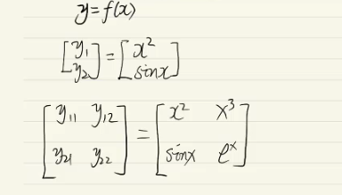

正向传播，计算图从左向右，输入层到输出层。

反向传播，backward propagation，计算图从右向左，输出层到输入层。

反向传播就是推出权重。

有多个输入要累加，例如上图中的a和b。

## 激活函数

1. 等值函数
2. sigmoid函数

3. softmax函数

4. tanh函数

5. relu函数

## 梯度下降法

求极值

1. 一阶导数为0，二阶导数确定是凹还是凸。

2. $\theta = \theta-\alpha\frac{df(x)}{dx}$，理想情况是梯度为0收敛，然而一般情况是梯度小于某一个值收敛。

## 链式求导法则

https://en.wikipedia.org/wiki/Chain_rule

## 张量求导

Tensor (张量)：标量是0阶张量，向量是1阶张量，矩阵是2阶张量。

标量，矢量（大小和方向）。

tensor function: 因变量是tensor的函数（f(x)中的x是自变量）。

**向量对向量求导**

**Y上下拉，X左右拉**）（分子布局）。

**向量对矩阵求导**

**标量对向量求导**

y纵向拉，下面那个数横向拉。

向量对向量求导，两个向量都是一阶的，求导结果是一个矩阵。

向量对矩阵求导，一阶对二阶求导，求导结果是一个三阶的张量。

标量对向量求导，零阶对一阶求导，求导结果还是一阶的。

综上**求导是一个升阶操作，并且求导结果的阶数等于求导的两个张量的阶数之和**。

**YX拉伸术，先把Y拉开再把X拉开，然后让Y对X的每一个分量逐项求导，得到的就是我们想要的最终结果**。

**向量对向量求导，得到的这个矩阵就是雅可比矩阵**。

## 推导BP

三层，输入一层，隐藏层一层，输出层一层。

## Deep Neuron network

切割乘28*28个小方块，每个上面记录像素信息。

这个连隐藏层都没有，(weight) w 和 Bias (b)。

越深层的网络能学到越多的特征。

## 详细的BP推导

https://www.bilibili.com/video/BV11k4y167rQ/?spm_id_from=333.788.recommend_more_video.0&vd_source=e7b16c1436c5aa56218de64d46a47a28

https://www.bilibili.com/video/BV1QV4y1E7eA/?vd_source=e7b16c1436c5aa56218de64d46a47a28

