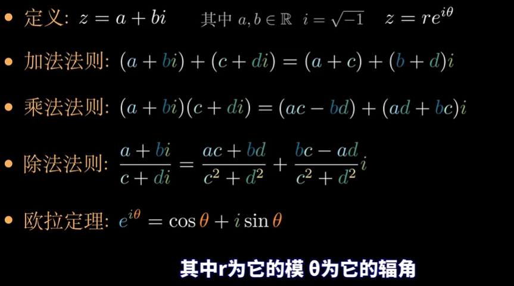
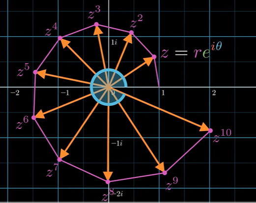

# 快速傅里叶变换

https://www.bilibili.com/video/BV1Y7411W73U/?vd_source=e7b16c1436c5aa56218de64d46a47a28

https://www.bilibili.com/video/BV1CY411R7bA/?vd_source=e7b16c1436c5aa56218de64d46a47a28

## 复数 complex number

除法法则是上下同乘分母的共轭复数，即c-di。

$z=x+yi=r(cos\theta+isin\theta)=re^{i\theta}$

$z_1*z_2=r_1*r_2*e^{(i\theta_{1}+i\theta_2)}$

