## What is a deep neural network?

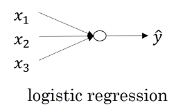

逻辑回归没有隐藏层。

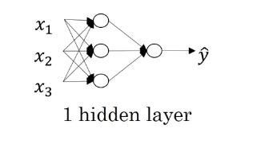

one hidden layer neural network

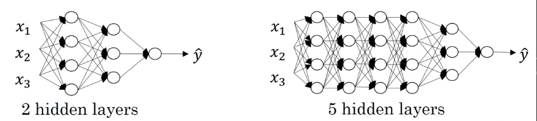

算一个神经网路的层数的时候，并不计算输入层，只计算隐藏层和输出层。

意识到一个问题的解决需要几层神经网络是很困难的，所以我们一般先试一下Logistic regression，如果不行然后尝试一层神经网络，如果还不行就逐层递加。

然后把隐藏层数量当成一个可以自由选择数值大小的超参数，然后在保留交叉验证数据上评估或者用你自己的开发集评估。

Deep neural network notation，回归一下符号

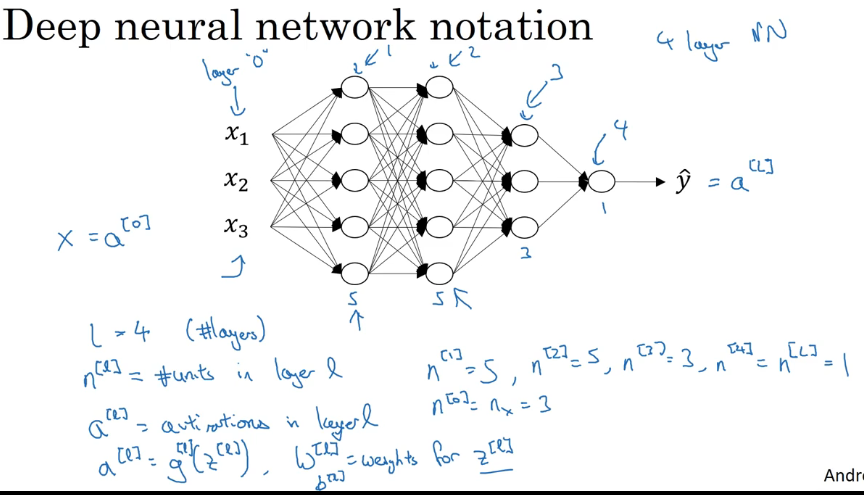

一共4个layer。神经元个数分别是5，5，3，1。输入层有三个。

$a^{[l]}$是每一层的激活函数的结果。

$a^{[l]}=g^{[l]}(Z)^{[l]}$，W是权重，b is bias.

---------------

## Forward Propagation in a Deep Network

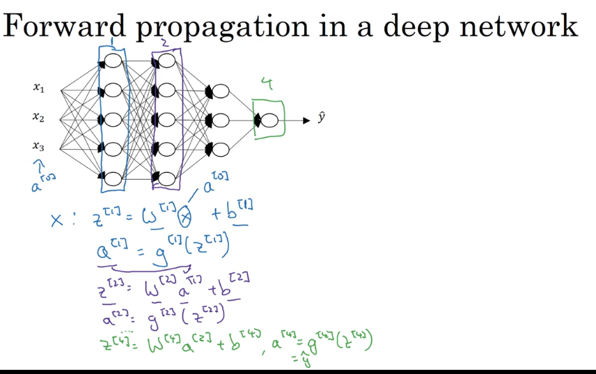

$Z^{[L]}=W^{[L]}A^{[l-1]}+b^{[l]},  A^{[l]}=g^{[l]}(Z^{[l]})$

Z的每一列都是一个小z，一共m（样本数量）列。

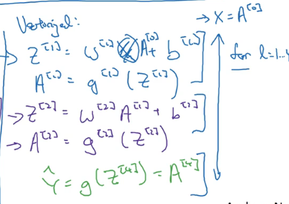

实现正向传播的时候，用for循环也是可以的。从第一层的激活函数开始，一直到最后输出层。

神经网络主要的bug来源就是矩阵的shape。

## Getting your matrix dimensions right

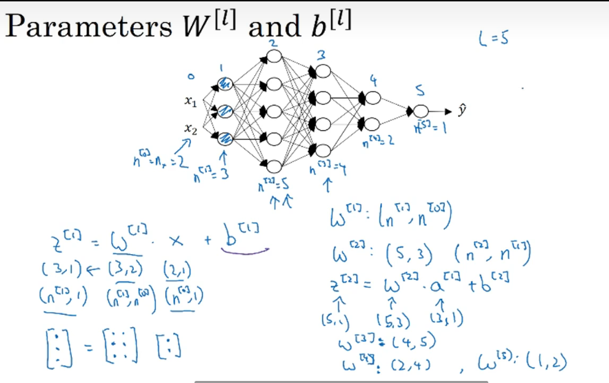

W的维度就和我之前自己总结的一样，（当前维度的神经元数量，上一层的神经元数量）

$W^{[l]},dW^{[l]}: (n^{[l]},n^{[l-1]});  $

$b^{[l]},db^{[l]}: (n^{[l]},1)$

$维度方面：A^{[l]} = Z^{[l]}$，当L=0时候，就是输入层，此时$A^{[0]}=X=(n^{[0]},m)$

$Z^{[l]}=W^{[l]}X+b^{[l]}$

$(n^{[l]},1),(n^{[1]},n^{[l-1]}),(n^{[l-1]},1),(n^{[l]},1)$

$(n^{[l]},m),(n^{[1]},n^{[l-1]}),(n^{[l-1]},m),(n^{[l]},1)$

Z的每一列是一个小z，一共m列，m是样本数量。

唯独方面$dA^{[l]}=dZ^{[l]}=A^{[l]}=Z^{[l]}$

## Why deep representations?

前言：通常我们不需要很大的神经网络，但需要很深的神经网络，需要有较多的隐藏层。

**Intuition about deep representation**

如果你再建立一个人脸识别或者是人脸检测系统，深度神经网络所做的事情就是，当你输入一张人脸的图片，然后你可以把深度神经网络的第一层当作一个特征探测器或者边缘探测器。

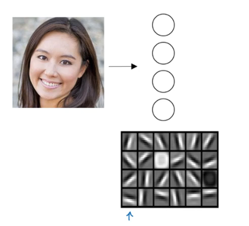

20个隐藏单元的深度神经网络是怎么针对这张图计算的。

这20个隐藏单元找的是这张图片的各个边缘，我们可以把照片里组成边缘的像素们放在一起看，然后它可以把被探测到的边缘组合成面部的不同部分。最后再把这些部分放在一起，比如鼻子眼睛下巴，就可以识别或是探测不同的人脸了。

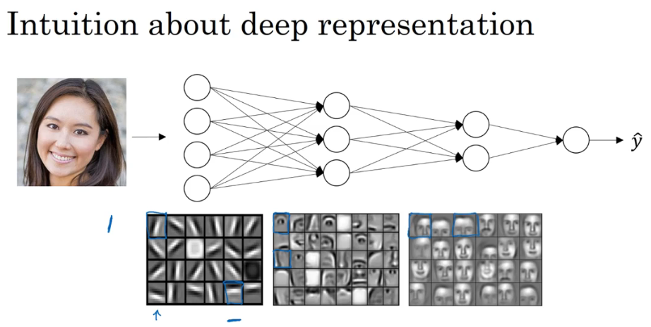

你可以直觉上把这种神经网络的前几层当作探测简单的函数，比如边缘，之后把它们跟后几层结合在一起，那么他们可以学习更多复杂的函数。

One technical detail of this visualization the edge detectors are looking in relatively small areas of an image may be very small regions like that and then the facial detectors you can look at may be much larger areas in the image but the main intuition when you take away from this is just finding simple things like edges and then building them up composing them together to detech more complex things like an eye or a nose and the composing those together to find even more complex things and this type of simple to complex hierarchical representation or compositional representation applies in other types of data than images and face recognition as well.

For example if you are trying to build a speech recognition system, 需要解决的就是如何可视化语音，比如你输入一个音频片段，那么神经网络的第一层可能就会先开始试着探测比较低层次的音频波形的一些特征，比如音调是变高了还是低了，分辨白噪音或者音调，可以选择这些相对程度比较低的波形特征，然后把这些波形组合在一起，就能去探测声音的基本单元（音位），有了基本的声音单元之后，将他们组合起来，你能够识别音频当中的单词，单词再组合起来就能识别词组，再到完整的句子。

So deep neural network with multiple hidden layers might be able to have the earlier layers learn these low levels simpler features and then have the later deeper layers then put together the simpler things that's detected in order to detech more complex things. 比如你录在音频里的单词，词组或者句子，之后就可以执行语音识别了 and what we see is that whereas the earlier layers are computing what seems like relatively simple functions of the input such as where are the edges by the time you get deep in the network you can actually do surprisingly complex things 比如探测面部，或者探测单词 短语或者句子。有些人喜欢把深度神经网络和人类大脑作类比，这些神经科学家觉得人的大脑也是先探测简单的东西，比如你眼睛看到的边缘，然后组合起来才能探测复杂的物体，比如脸。

Circuit (电路) theory and deep learning，神经网络为何有效的理论

Informally: There are functions you can compute with a “small” L-layer deep neural network that shallower networks require exponentially more hidden units to compute.

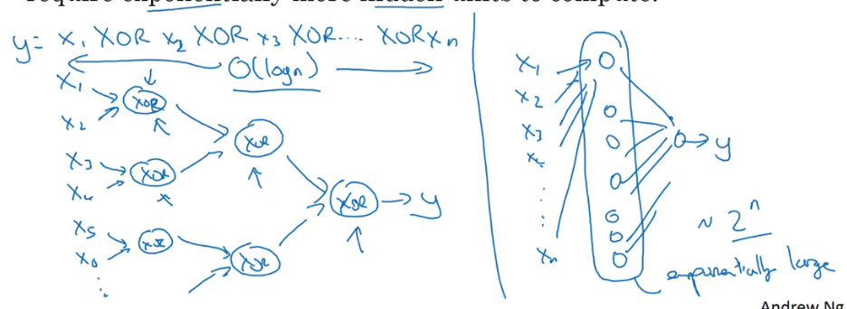

XOR异或，不同为1。

越深每层需要的神经单元数量越少，越浅每层的需要的神经单元数量越多。

解决问题的思路还是从最简单的逻辑回归开始试，如果效果不好，那么逐层递加，但也别加的太多，因为会出现过拟合的情况。

## Building blocks of deep neural networks

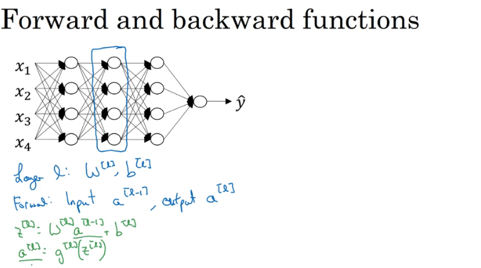

把$Z^{[l]}$的值缓存起来（cache），因为$Z^{[l]}$对之后的正向反向传播的步骤都非常有用。

layer l:

Forward: $input: A^{[l-1]},output: A^{[l]}$

$Z^{[l]} = W^{[l]}A^{[l-1]}+b^{l},A^{[l]}=g^{[l]}(Z^{[l]})$

Backward: $input: dA^{[l]},Z^{[l]}(cache);output:dA^{[l-1]},dW^{[l]},db^{[l]}$

输出为了实现梯度下降。

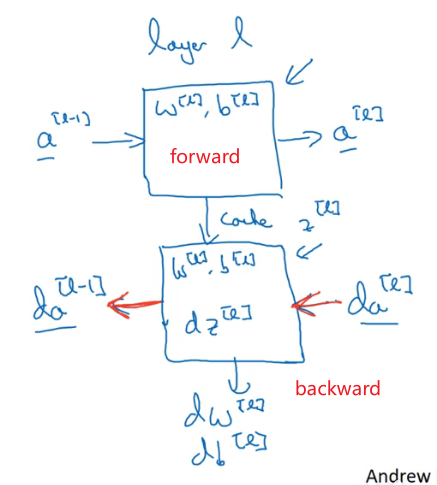

方框内是所需的参数。

输入特征（X）的导数起码对于训练监督学习的权重不算重要。

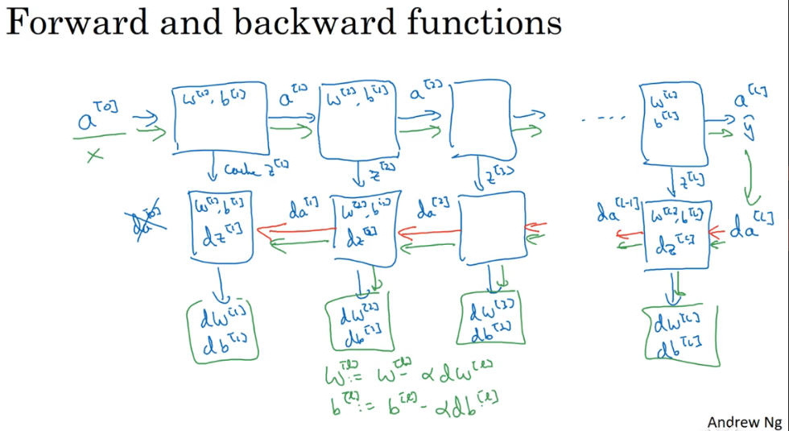

把反向函数计算出来的Z值缓存下来（存入字典当中，方便调用）。

-----------------------

## Forward and backward propagation

每一层都有的前向传播步骤，以及一个相对的反向传播步骤。

**How to implement these steps**

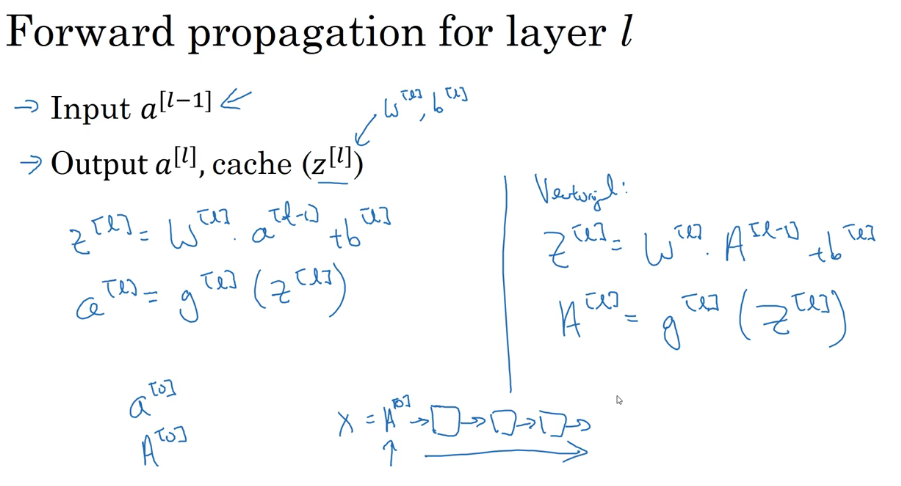

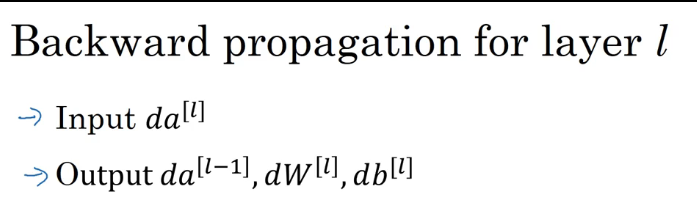

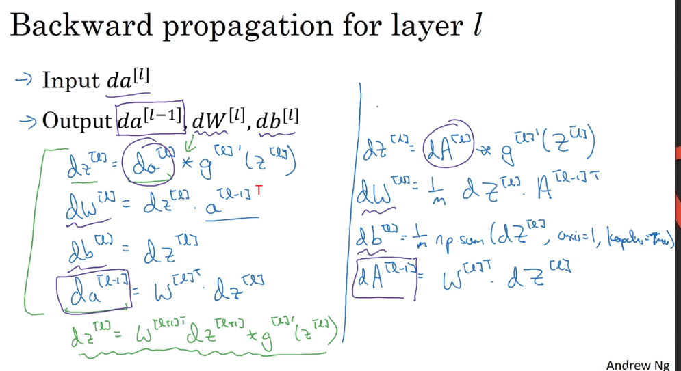

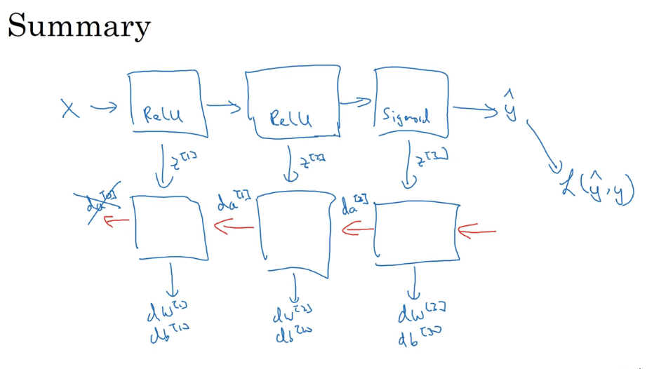

求导。前向递归，我们会用输入数据X来初始化，那反向递归呢，当你用logistic regression，做二分类的时候，

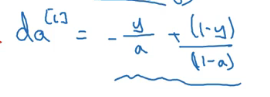

向量化版本。

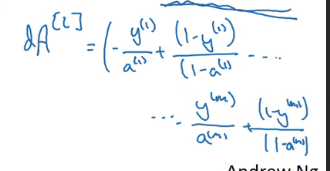

深度学习算法的复杂性来源于数据而不是写的代码。

### Parameters VS Hyperparameters

想要你的深度神经网络起到一个很好的效果，你还需要规划好自己的参数以及超参数。

### What are hyperparameters?

**Parameters:** $W^{[1]},b^{[1]},W^{[2]},b^{[2]}...$

**Hyperparameters:** 

1. learning rate $\alpha$
2. iterations
3. number of hidden layers L
4. hidden units $n^{[1]}，n^{[2]}...$
5. choice of activation function: sigmoid, tanh, ReLU
6. Others: Momentum, minibatch size, regularization parameters

超参数需要自己来设置，and these are parameters that control the ultimate parameters W and b and so we call all of these things below hyperparameters. 

实际上深度学习有很多不同的超参数，和机器学习早期相比。

超参数的选择有很多的可能性，需要尝试不同的值，一开始很难确定最优值是什么。

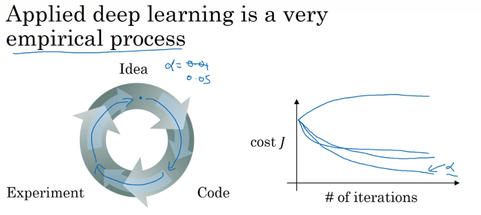

Vision, speech, NLP, online AD, web search, product recommendations

超参数是一直变化的，电脑的CPU或者GPU改变，也可能改变参数的最优值。

时间一长需要不断检查是否有更好的超参数数值。交叉验证 (cross validation)。

## What does this have to do with the brain

事实上关系不大。

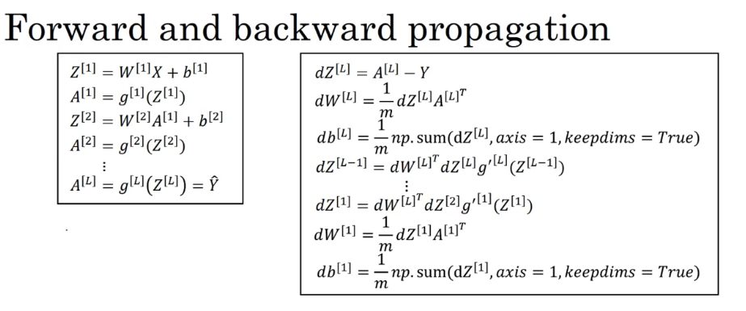

人的大脑显而易见比深度神经的神经元复杂得多。

深度学习在监督学习中，学习输入到输出的映射。