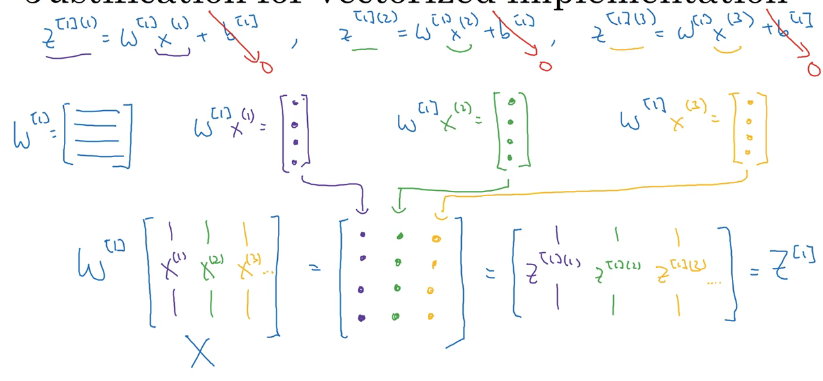

## Neural network Overview


方括号1和2表示layer1和layer2，圆括号1和2表示第一个和第二个。


backward calculation

calculate the derivatives $da^{[2]}, dz^{[2]}, db^{[2]}, dw^{[2]}$


 

## Neural network representation


input layer, hidden layer, output layer (负责输出预测值$\hat{y}$)

In a neural network, you train with supervised learning, the training set contains values of the inputs x as well as the target outputs y.

隐藏层的含义是：在训练集中，这些中间节点（隐藏层）的真正数值我们是不知道的。

训练集中只有输入和输出。


2 layer neural network。层数不包括输入层，所以是Hidden layer and output layer.

hidden layer的参数$w^{[1]}$和$b^{[1]}$


$w^{[1]}$是（4，3）是因为，4个隐藏层单元，3个特征输入。$b^{[1]}$是(4,1)同理。

$w^{[2]}$是（1，4）是因为，4个隐藏单元的输入，1一个输出单元。

总之就是当前层是第一位，后面那个是上一层的输入。


## Computing a Neural network's Output

 

logistic regression

这个圆圈代表了回归计算的两个步骤，首先计算z，然后计算激活函数，sigmoid(z)。


这是隐藏层的第一个单元，所以下标是1。

上标是layer number，下标是第几个节点，不存在上标或者下标为零的情况。


vectorize

```python
z^[1] = w^[1] * X + b^[1]
a^[1] = sigmoid(z^[1])
z^[2] = w^[2] * a^[1] + b^[2]
a^[2] = sigmoid(z^[2])
```


$z=w^T*x+b$,  $\hat{y}=\alpha=sigmoid(z)$


## Vectorizing across multiple examples


$A^{[1]}$解释：第一行第一个表示，第一个样本中的第一个隐藏单元的激活函数。

第一行第二个表示，第二个样本中的第一个隐藏单元的激活函数。

第二行第一个表示，第一个样本中的第二个隐藏单元的激活函数。

横向是不同的examples，纵向是不同的隐藏单元。


## Explanation for vectorized implementation




## Activation functions

1. sigmoid function----activation function


2. tanh function


平均值接近0，所以有数据中心化的作用。tanh function基本比sigmoid function所有场合都更优越。输出层除外，因为-1到0很难解释。特别是**二分类，sigmoid函数更好**。可以使用tanh function作为激活函数，sigmoid function作为输出层函数。


但sigmoid function 和tanh function共同缺点就是，当z特别小或者特别大的时候，这个导数的梯度或者说这个函数的斜率特别小，梯度下降速度会变得很慢。


因此**ReLU（rectified linear unit） function很受欢迎，基本是现在激活函数的默认**选择

 

z为负数则a是0，z为正数则a是导数是1，如果z正好是0，导数没有定义。

实际编程的时候，可以给0点的导数赋值，0或者1都可以，看情况。

ReLU的缺点：z为负数的时候，导数为0，在实践中这没什么问题，有足够多的隐藏单元，使得z大于0，所以对大多数训练样本来说还是很快的。

但还有另外一个版本的ReLU, **leaky ReLU**。通常leaky ReLU 比ReLU要好，但实际使用频率不高。

比起sigmoid function and tanh function, 使用ReLU function，你的神经网络通常学习的很快。

因为ReLU没有函数斜率接近0的时候（学习速度很慢）。


## Summary of Pros and Cons of different activation function

### sigmoid 


sigmoid function：除非用二元分类的输出层，不然尽量不要使用。否则几乎从来不用，因为Sigmoid适合的场合，tanh function会做得更好。


### tanh


tanh function

The real reason that **tanh is preferred compared to sigmoid**, especially when it comes to big data when you are usually struggling to find quickly the local (or global) minimum, is that the **derivatives of the tanh are larger than the derivatives of the sigmoid**. In other words, you **minimize your cost function faster if you use tanh as an activation function**.


### ReLU


最常用的ReLU function


### Leaky ReLU


f(y) 是 ay 和 y 中的最大值（a通常小于1）。

在建立神经网络时候，经常有不同的选择，隐藏单元数目，激活函数的选择，如何初始化权重。

根据实际情况选择合适激活函数。


## Why activation function is necessary


如果你按照上面那种情况来改的话，那么这个模型的输出 y 或者 $\hat{y}$ 不过是你输入特征x的线性组合。


如果你要用线性激活函数，或者叫恒等激活函数。那么神经网络只是把输入线性组合在输出。

我们稍后会谈到深度网络（很多层的神经网络，很多隐藏层）。

事实证明，如果你使用线性激活函数或者没有使用激活函数，那么无论你的神经网络有几层，一直在做的只是计算线性激活函数，所以不如直接去掉隐藏层。

通常情况下，**激活函数一定是非线性的**。

只有一个情况可以使用线性激活函数，就是在输出层，如果你要机器学习的是回归问题。etc.: predict housing prices，y是一个实数，而不是0和1。房价预测在隐藏层使用的激活函数依然是ReLU activation function（不会出现负数）。

在隐藏层使用线性激活函数：some very special circumstances relating to compression。


## Gradient descent

Derivatives of activation functions

反向传播，需要计算激活函数的斜率或者导数。

### sigmoid function


如果z=10, $g(z)\approx1, \frac{\mathrm{d} g(z)}{\mathrm{d} z} \approx 1(1-1)\approx0$

如果z=-10, $g(z)\approx0, \frac{\mathrm{d} g(z)}{\mathrm{d} z} \approx 0(1-0)\approx0$

如果z=0，$g(z)\approx 1/2, \frac{\mathrm{d} g(z)}{\mathrm{d} z} \approx 1/2(1-1/2)\approx1/4$

$g\prime(z)$也是导数的意思。那一个点叫做Prime，微积分表示函数g对输入变量z的导数。

$a = g(z), g\prime(z) = a(1-a)$


### tanh function


if $a=g(z)$,    $g\prime(z)=1-a^2$

同理可以按照上面试几个数，看看斜率。


ReLU and leaky ReLU function


将0点的导数设置为1和0都可以，对结果一般不影响。


0点的导数同样是没有定义的。


## Gradient descent for neural network

以一层隐藏单元举例


Parameters: $w^{[1]}(n^{[1]},n^{[0]})$

$b^{[1]}(n^{[1]},1)$

$w^{[2]}(n^{[2]}n^{[1]})$

$b^{[2]}(n^{[1]},1)$

圆括号里是维度。


每一层神经单元的数量 nx = $n^{[0]},n^{[1]},n^{[2]}=1$


Cost function: 

$J(w^{[1]},b^{[1]},w^{[2]},b^{[2]}) = \frac{1}{m}\sum_{i=1}^{m}L(\hat{y},y)$

$\hat{y}=a^{[2]}$

如果是二元分类，那么损失函数和logistic regression是一样。


Gradient descent:

训练神经网络之前，要进行随机初始化参数，不能全部设置为0。


$w^{[2]},b^{[2]}$也一样。

知道收敛才停止。


## Formulas for computing derivatives


## Backpropagation intuition


log都是以e为底的。


所以这就是Logistic regression

da = dL/da

dz = dL/dz

dw = dz*x

db = dz


算的顺序是

$da^{[2]},dz^{[2]},dw^{[2]},db^{[2]},da^{[1]},dz^{[1]},dw^{[1]},db^{[1]}$


2.13的时候推导过，dw=x*dzT, 因为此处的dW是dw的转置，所以dW=dwT=dz*xT=dz*aT

这里的a[1]就是第三个框里面x，da[1]=dx=W[2]T*dZ[2]

这里的逐元素乘积*保证矩阵维度不变，其实就是每个元素都是需要进行一次这样的求导操作，因为前向传播时激活函数就是针对每个元素进行的操作


实现后向传播算法有个技巧，矩阵的维度互相匹配。

dz[1]可以理解为：前面的W[2].T*dz[2]是dL(a[2],y)/da[1]，后面的g‘(z[1])是da[1]/dz[1]相乘就是d(L(a[2],y))/da[1] *da[1]/dz[1]

 求dz^[1]^想象成三部分相乘的链式法则(dL/dz^[2]^)*(dz[2]/da^[1])*(da^[1]^/dz^[1])


矩阵链式求导的基本原理是，如果有一个矩阵函数 $F(X)$，其中 $X$ 是一个 $n \times m$ 的矩阵，那么我们可以使用链式法则来求出 $\frac{\partial F}{\partial X}$，即矩阵函数 $F$ 对矩阵 $X$ 的导数。

矩阵链式求导的具体过程如下：

首先，假设我们有一个矩阵函数 $F(X)$，其中 $X$ 是一个 $n \times m$ 的矩阵，并且我们希望求出 $\frac{\partial F}{\partial X}$。

然后，我们可以使用链式法则来求出 $\frac{\partial F}{\partial X}$，即：

$$\frac{\partial F}{\partial X} = \frac{\partial F}{\partial X_1} + \frac{\partial F}{\partial X_2} + \dots + \frac{\partial F}{\partial X_n}$$

其中，$X_1, X_2, \dots, X_n$ 是矩阵 $X$ 的列向量，并且 $\frac{\partial F}{\partial X_i}$ 表示矩阵函数 $F$ 对矩阵 $X_i$ 的导数。

最后，我们可以通过递归的方式来求出 $\frac{\partial F}{\partial X_i}$，即对于每一列 $X_i$，我们都可以通过链式法则


## Random initialization

当你训练一个神经网络时，随机初始化权重非常重要，对于logistic regression，可以将权重初始化为0。但如果将神经网络的各参数数组全部初始化为0，再使用梯度下降算法，那会完全无效。


将Bias b初始化为0实际上是可行的，但是如果把W初始化为全零那就会出现问题了。

这种初始化的问题在于，你给网络输入任何样本，你的$a^{[1]}_1和a^{[1]}_2$是一样的。

因为两个隐藏单元的都在做完全一样的计算。


我们可以通过归纳法证明，每次训练迭代后，两个隐藏单元依然在计算完全相同的函数。


因为很大一部分网络记忆dW是这样一个矩阵。


每一行的数值是一样的，那么就算之后使用梯度下降进行权重更新，那么更新之后的结果也是相同。


两个隐藏单元一开始就在做同样的计算，并且两个隐藏单元对输出单元的影响也一样大，那么在一次迭代后，同样的对称性依然存在，两个隐藏单元仍然是对称的。所以无论你训练多长时间的神经网络，两个隐藏单元仍然在计算完全一样的函数，这种情况下，多个隐藏单元就失去了意义，因为他们都在计算的都是同样的东西。这一点用处也没有，因为我们需要两个不同的隐藏单元，去计算不同的函数。

解决方案：initialize your parameters randomly

B完全没有这个对称性问题，所谓的破坏对称性问题，所以把B初始化为0是可以的


一般把权重初始化为特别小的随机值。

因为如果这个数特别大，或者特别小的话（负数），梯度一开始就是很小，梯度下降算法会很慢，因此学习速率就会很慢。（tanh function and sigmoid function）


if you don't have any sigmoid or tanh activation functions throughout your neural network, this is less of an issue but if you are doing binary classification and your output unit is a sigmoid function, then you know you just don't wan the initial parameters to be too large.

所以这就是为什么设置0.01的原因，但不一定一定是0.01。

当你训练一个单隐藏层神经网络时，这是一个相对较浅的神经网络，没有太多的隐藏层。设置为0.01是可以的，但是when you are training a very deep neural network，then you might want to pick a different constant as 0.01。but either way it will usually end up being a relatively small number。


