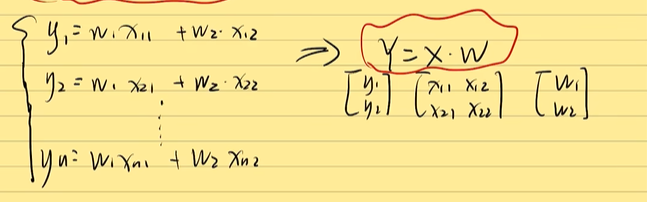

如果$f(x)=\dot{x^T}{x}$，那么$\frac{df(x)}{dx}=?$

## 向量函数和矩阵求导的初印象

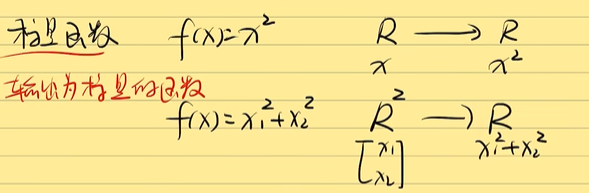

**标量函数**：输出为标量的函数。

**向量函数**：输出为向量（矩阵）的函数

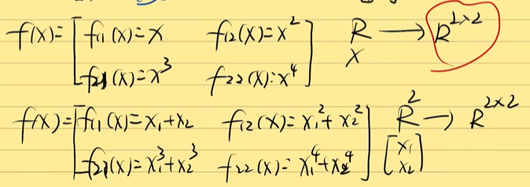

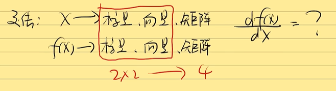

四种情况：

标量对标量求导，向量对向量求导，标量对向量求导，向量对标量求导。

**矩阵求导的本质：**

$\frac{dA}{dB}$:矩阵A中的每一个元素对矩阵B中每一个元素求导。

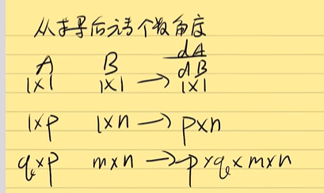

## 求导秘术--Yx拉伸

1. 标量不变，向量拉伸。
2. 前面横向拉，后面纵向拉，Y横向拉，X纵向拉。

分母布局，雅可比矩阵。

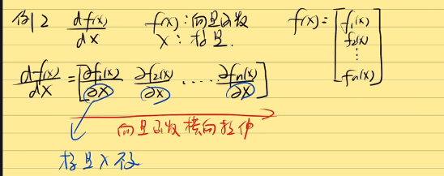

X和Y都是向量的话，先拉伸X

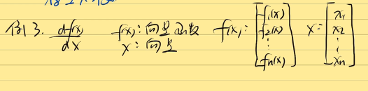

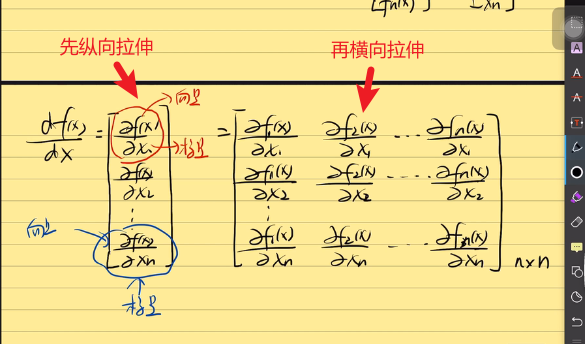

## 常见矩阵求导公式推导

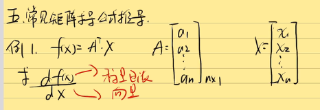

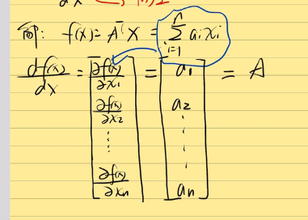

PS：$f(x)=A^{T}X=X^{T}a$，之所以可以这么写是因为$f(x)$是标量。

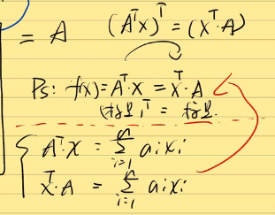

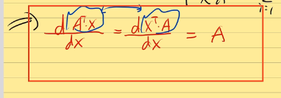

例二：

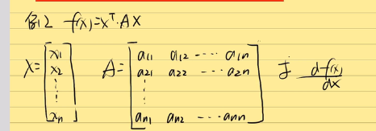

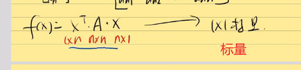

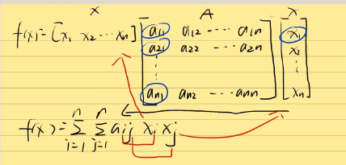

Y横向拉，X纵向拉，Y是标量。

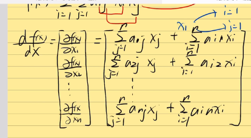

有两个X，一个X是左边横着的，一个X是右边竖着的。

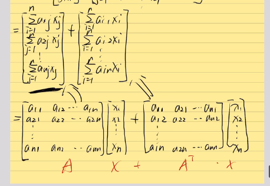

## 矩阵求导的细节补充

1. 两种布局

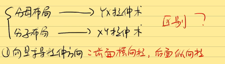

YX拉伸术----分母布局

Y横向（f(x)）

X纵向

XY拉伸术---分子布局

X横向

Y纵向

两种布局，求导后元素排列不同。

2. 通常，$(分母布局的求导)^T=(分子布局)$

矩阵求导的本质---------矩阵A中每一个元素对矩阵B中每一个元素求导，结果一样怎么排列并不影响。

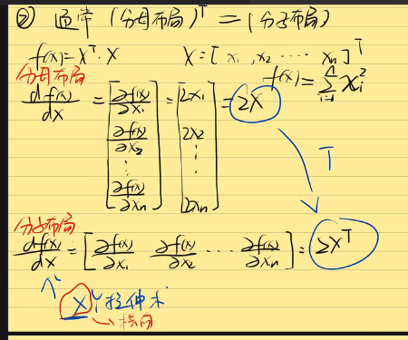

矩阵求导的乘法公式

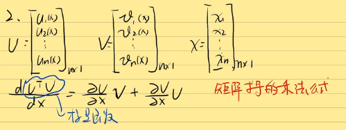

两边都是N*1维的。

矩阵求导的加法公式。

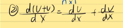

## 最小二乘法

以分母布局为例

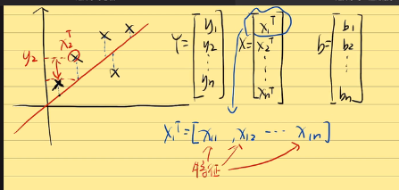

线性回归，squared cost function最小

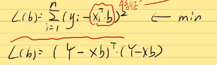

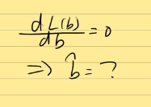

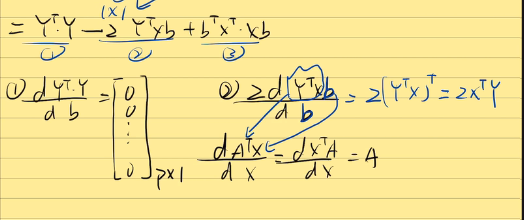

套用之前的公式。

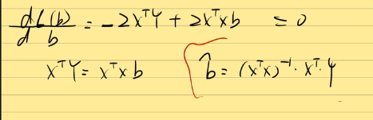