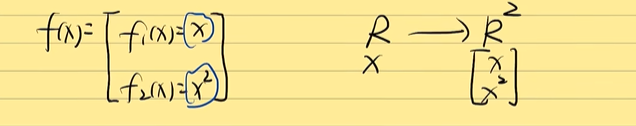
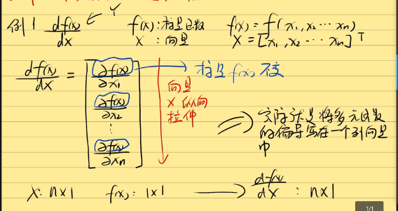
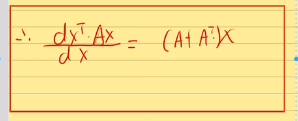
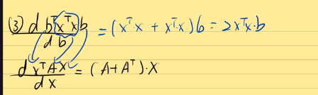

如果$f(x)=\dot{x^T}{x}$，那么$\frac{df(x)}{dx}=?$

## 向量函数和矩阵求导的初印象

**标量函数**：输出为标量的函数。

**向量函数**：输出为向量（矩阵）的函数

四种情况：

标量对标量求导，向量对向量求导，标量对向量求导，向量对标量求导。

**矩阵求导的本质：**

$\frac{dA}{dB}$:矩阵A中的每一个元素对矩阵B中每一个元素求导。

## 求导秘术--Yx拉伸

1. 标量不变，向量拉伸。
2. 前面横向拉，后面纵向拉，Y横向拉，X纵向拉。

分母布局，雅可比矩阵。

X和Y都是向量的话，先拉伸X

## 常见矩阵求导公式推导

PS：$f(x)=A^{T}X=X^{T}a$，之所以可以这么写是因为$f(x)$是标量。

例二：

Y横向拉，X纵向拉，Y是标量。

有两个X，一个X是左边横着的，一个X是右边竖着的。

## 矩阵求导的细节补充

1. 两种布局

YX拉伸术----分母布局

Y横向（f(x)）

X纵向

XY拉伸术---分子布局

X横向

Y纵向

两种布局，求导后元素排列不同。

2. 通常，$(分母布局的求导)^T=(分子布局)$

矩阵求导的本质---------矩阵A中每一个元素对矩阵B中每一个元素求导，结果一样怎么排列并不影响。

矩阵求导的乘法公式

两边都是N*1维的。

矩阵求导的加法公式。

## 最小二乘法

以分母布局为例

线性回归，squared cost function最小

套用之前的公式。

