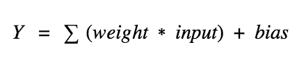

[了解神经网络，你需要知道的名词都在这里 | 机器之心 (jiqizhixin.com)](https://www.jiqizhixin.com/articles/2017-11-04-3)

**神经元（节点）**—神经网络的基本单元，它包括特定数量的输入和一个偏置值。当一个信号（值）输入，它乘以一个权重值。如果一个神经元有 4 个输入，则有 4 个可在训练中调节的权重值。

.png)

.png)

*神经网络中一个神经元的运算*

.png)

**连接**—它负责连接同层或两层之间的神经元，一个连接总是带有一个权重值。训练的目标是更新这一权重值以降低损失（误差）。

.png)

**偏置（Offset）**—它是神经元的额外输入，值总是 1，并有自己的连接权重。这确保即使当所有输入为 0 时，神经元中也存在一个激活函数。

**激活函数（迁移函数）**—激活函数负责为神经网络引入非线性特征。它把值压缩到一个更小范围，即一个 Sigmoid 激活函数的值区间为 [0,1]。深度学习中有很多激活函数，ReLU、SeLU 、TanH 较 Sigmoid 更为常用。更多激活函数，请参见[《一文概览深度学习中的激活函数》](https://www.jiqizhixin.com/articles/2017-11-02-26)。

.png)

*各种激活函数*

.png)

*基本的神经网络设计*

**输入层**—神经网络的第一层。它接收输入信号（值）并将其传递至下一层，但不对输入信号（值）执行任何运算。它没有自己的权重值和偏置值。我们的网络中有 4 个输入信号 x1、x2、x3、x4。

**隐藏层**—隐藏层的神经元（节点）通过不同方式转换输入数据。一个隐藏层是一个垂直堆栈的神经元集。下面的图像有 5 个隐藏层，第 1 个隐藏层有 4 个神经元（节点），第 2 个 5 个神经元，第 3 个 6 个神经元，第 4 个 4 个神经元，第 5 个 3 个神经元。最后一个隐藏层把值传递给输出层。隐藏层中所有的神经元彼此连接，下一层的每个神经元也是同样情况，从而我们得到一个全连接的隐藏层。

**输出层**—它是神经网络的最后一层，接收来自最后一个隐藏层的输入。通过它我们可以得到合理范围内的理想数值。该神经网络的输出层有 3 个神经元，分别输出 y1、y2、y3。

**输入形状**—它是我们传递到输入层的输入矩阵的形状。我们的神经网络的输入层有 4 个神经元，它预计 1 个样本中的 4 个值。该网络的理想输入形状是 (1, 4, 1)，如果我们一次馈送它一个样本。如果我们馈送 100 个样本，输入形状将是 (100, 4, 1)。不同的库预计有不同格式的形状。

输入形状是指在进行机器学习或深度学习时，输入数据的维度和大小。例如，如果输入数据是一个二维矩阵，则输入形状可能是(batch_size, num_features)，其中batch_size是给定批次中包含的样本数量，num_features是每个样本中特征的数量。

输入形状对于确定模型设计和超参数设置非常重要，因为它们决定了模型所能处理的数据的大小和类型。例如，如果输入形状是(batch_size, num_features)，则模型可能需要有足够的输入层单元来处理num_features个特征，并且可能需要有足够的隐藏层单元来保存所有批次中的样本。

**权重（参数）**—权重表征不同单元之间连接的强度。如果从节点 1 到节点 2 的权重有较大量级，即意味着神将元 1 对神经元 2 有较大的影响力。一个权重降低了输入值的重要性。权重近于 0 意味着改变这一输入将不会改变输出。负权重意味着增加这一输入将会降低输出。权重决定着输入对输出的影响力。

.png)

*前向传播*

**前向传播**—它是把输入值馈送至神经网络的过程，并获得一个我们称之为预测值的输出。有时我们也把前向传播称为推断。当我们馈送输入值到神经网络的第一层时，它不执行任何运算。第二层接收第一层的值，接着执行乘法、加法和激活运算，然后传递至下一层。后续的层重复相同过程，最后我们从最后一层获得输出值。

.png)

*反向传播*

**反向传播**—前向传播之后我们得到一个输出值，即预测值。为了计算误差我们对比了带有真实输出值的预测值。我们使用一个损失函数（下文提及）计算误差值。接着我们计算每个误差值的导数和神经网络的每个权重。反向传播运用微分学中的链式法则，在其中我们首先计算最后一层中每个误差值的导数。我们调用这些导数、梯度，并使用这些梯度值计算倒数第二层的梯度，并重复这一过程直到获得梯度以及每个权重。接着我们从权重值中减去这一梯度值以降低误差。通过这种方式我们不断接近局部最小值（即最小损失）。

.png)

**学习率**—训练神经网络的时候通常会使用梯度下降优化权重。在每一次迭代中使用反向传播计算损失函数对每一个权重的导数，并从当前权重减去导数和学习率的乘积。学习率决定了更新权重（参数）值的快慢。学习率应该尽可能高而不会花费太多时间达到收敛，也应该尽可能低从而能找到局部最优。

.png)

*精度和召回率*

**准确率**—测量值对标准（或已知）值的接近程度。

**精度**—两个测量值之间的接近程度，表示测量的可重复性或可再现性。

**召回率（敏感度）**—全部相关实例中被恢复的相关实例的比率。

.png)

*Tp 指真正，Tn 指真负，Fp 指假正，Fn 指假负。*

**混淆矩阵**—维基百科的解释是：

> 机器学习领域和统计分类问题中，混淆矩阵（也称为误差矩阵／error matrix）是一个算法性能的可视化表格，通常在监督学习中使用（无监督学习中混淆矩阵通常称为匹配矩阵，／matching matrix）。矩阵的每一行表示一个预测类，每一列表示一个真实类（或相反）。使用真实的名词使其易于解读，能简单地看出系统对两个类别的混淆程度（即将一个类别的物体标记为另一个）。

.png)

*混淆矩阵*

**收敛**—随着迭代次数增加，输出越来越接近具体的值。

**正则化**—用于克服过拟合问题。正则化过程中通过添加一个 L1（LASSO）或 L2（Ridge）规范到权重向量 w（通过给定算法学习到的参数）上以「惩罚」损失项：

L（损失函数）+λN（w）—这里的λ是正则项，N（w）是 L1 或 L2 规范。

**归一化**—数据归一化是将一个或多个属性缩放至 0 到 1 的范围的过程。当不知道数据分布或分布不是高斯分布（钟形曲线）（）的时候，归一化是很有用的，可加速学习过程。

**全连接层**—一个层所有的节点的激活函数值作为下一层的每个节点的输入，若这对所有的层都成立，则称这些层为全连接层。

.png)

*全连接层*

**损失函数/代价函数**—损失函数计算单个训练样本的误差，代价函数是整个训练集的损失函数的平均。

- 「mse」—平均方差
- 「binary_cross entropy」—二分类对数损失（log loss）
- 「categorical_cross entropy」—多分类对数损失（log loss）

**模型优化器**—优化器是一种搜索技术，用于更新模型的权重。

- SGD—随机梯度下降，支持动量算法。
- RMSprop—适应性学习率优化方法，由 Geoff Hinton 提出。
- Adam—适应性矩估计（Adam）并同样使用了适应性学习率。

**性能指标**—用于测量神经网络性能的指标，例如，准确率、损失、验证准确率、验证损失、平均绝对误差、精度、召回率和 f1 分数等等。

**批大小**—一次前向/反向传播中适用的样本数，批大小越大，占用的内存量越大。

**训练 epochs**—模型在训练数据集上重复训练的总次数。

一个 **epoch** = 全部训练实例的一次前向和一次反向传播。