# Introduction

## What is Neural network

house price prediction

we can't use linear regression, cause the price of house can't be negative.

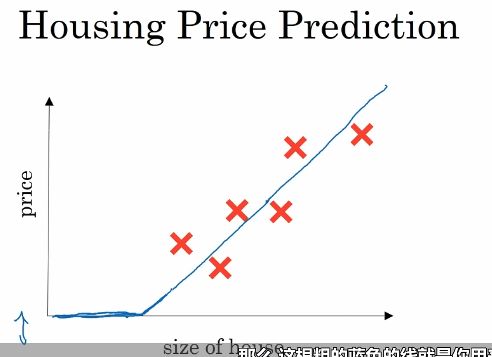

input--size of the house

output--price of house

the node is the neuron

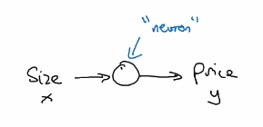

ReLU (Rectified Linear Unite) function

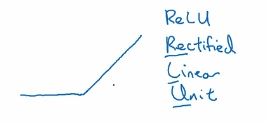

single neuron

neural network is formed by many of the single neurons and stacking them together.

Example of simple neural network

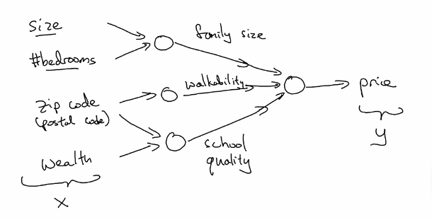

简化图

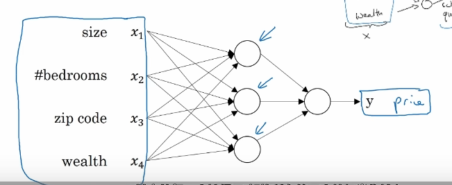

中间的neurons叫做hidden units

the neural network, each of them takes its inputs all four input features

每个神经元都将所有的四个特征当作输入，神经网络自己决定，这些网络节点是什么，完成什么任务

输入层：input layer，第一层是全连接的，因为每个特征输入都会链接每个输入层神经元。

 如果给足够的训练数据x和y，神经网络就能很好的拟合出一个函数来建立x和y之间的映射关系。

神经网络在监督学习中，最有用最强大。所谓监督学习，就是需要把一个输入x和一个输入y相对应起来。

## Supervised learning

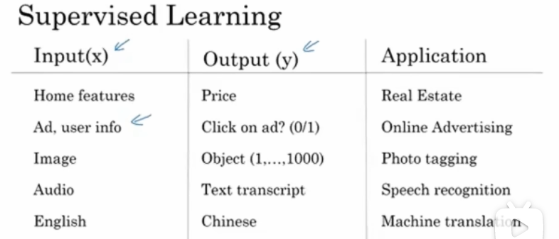

standard neural network, 

image application, we often use convolution on neural networks,CNN

sequence data----audio----RNN (Recurrent neural network)

language translation---also sequence data--RNNs

autonomous driving-----custom, complex, hybrid neural network

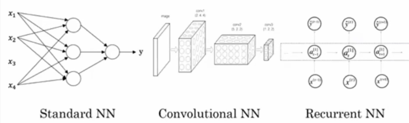

Structured data, Unstructured data

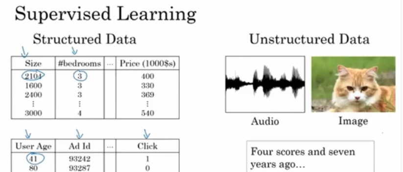

human race has evolved to be very good at understanding the unstructured data, however computers are good at structured data.

thanks to deep learning and neural networks, computers are now much better are interpreting unstructured data compared to just a few years ago.

产生了很多有趣应用: speech recognition (语音识别), image recognition (图像识别), natural language processing on text.

神经网络主要改变了监督学习。

## Deep learning and neural network

为什么现在才火？

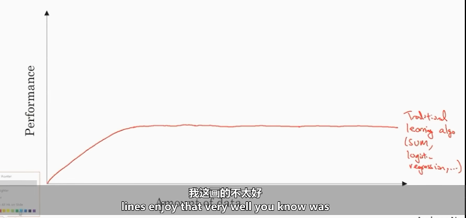

traditional learning algorithm: SVM和逻辑回归，很难处理大量数据

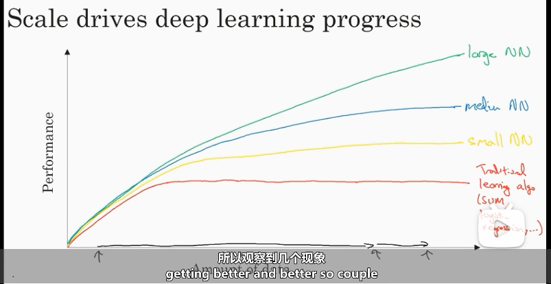

large network

big enough neural network in order to take advantage of huge amount of data.

big neural network and big data

x坐标轴表示的是labeled data

输入x和标记y, 

当数据量很小的时候，每个算法的表现排名并不固定。性能更多的是由你提取特征的能力和算法的细节而决定的。

只有当数据集特别大的时候，算法排名很明显，大规模的neural network最好。

算法的更新迭代使得神经网络运行得更快。

sigmoid function and ReLU function

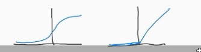

sigmoid函数两端的梯度很小，因此学习的效率很低（梯度下降）

activation function the neural network to use ReLU function, the gradient of all positive values input is one, 那么梯度就不会慢慢变成0.

把sigmoid函数换成ReLU函数，梯度下降速度提高很多 ，这使得我们可以训练更大的神经网络

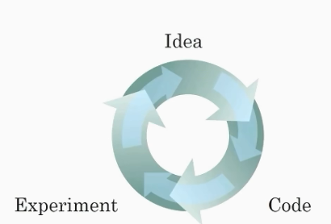

训练神经网络的过程很像一个循环

有一个网络架构的想法，implement your idea and code

run a experiment which tells you how well your neural network does 

by looking at it and you go back to change the details of your neural network

then you go around this circle over and over

当你的神经网络需要花费很长时间训练的时候，大量时间就会消耗在这个循环里。

训练时间和得到结果时间越短，就可以尝试更多的想法。

fast computation会提高你实践结果的速度。

所以不断更新算法。

随着硬件和软件的发展，建造大型神经网络的能力会越来越大。算法创新也很重要。

10 个多选

[【中英】【吴恩达课后测验】Course 1 - 神经网络和深度学习 - 第一周测验_何宽的博客-CSDN博客_吴恩达深度学习何宽](https://blog.csdn.net/u013733326/article/details/79862336)
