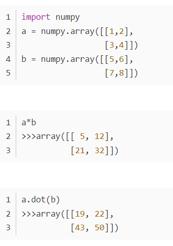
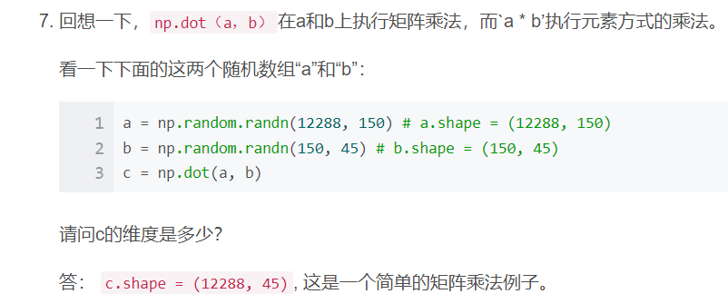
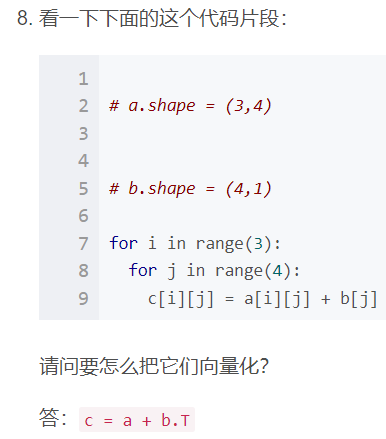
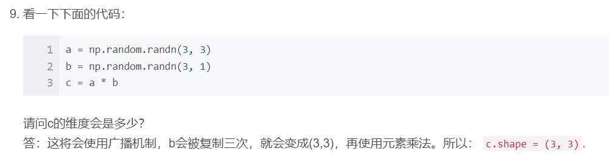

假设img是一个（32,32,3）数组，具有3个颜色通道：红色、绿色和蓝色的32x32像素的图像。 如何将其重新转换为列向量？

```python
x = img.reshape((32 * 32 * 3, 1))
```


看一下下面的这两个随机数组“a”和“b”：

```python
a = np.random.randn(2, 3) # a.shape = (2, 3)
b = np.random.randn(2, 1) # b.shape = (2, 1)
c = a + b
```

请问数组c的维度是多少？

答： B（列向量）复制3次，以便它可以和A的每一列相加，所以：c.shape = (2, 3)


看一下下面的这两个随机数组“a”和“b”：

```python
a = np.random.randn(4, 3) # a.shape = (4, 3)
b = np.random.randn(3, 2) # b.shape = (3, 2)
c = a * b
```

请问数组“c”的维度是多少？

答：运算符 “*” 说明了按元素乘法来相乘，但是元素乘法需要两个矩阵之间的维数相同，所以这将报错，无法计算。




星乘表示矩阵内各对应位置相乘，矩阵a*b下标(0,0)=矩阵a下标(0,0) x 矩阵b下标(0,0)；

点乘表示求矩阵内积，二维数组称为矩阵积（mastrix product）。


假设你的每一个实例有n_x个输入特征，想一下在X=[x^(1), x^(2)…x^(m)]中，X的维度是多少？

答： `(n_x, m)`

m是样本数量。










看一下下面的计算图：

```
J = u + v - w
  = a * b + a * c - (b + c)
  = a * (b + c) - (b + c)
  = (a - 1) * (b + c)
```

