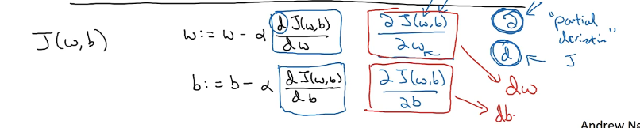
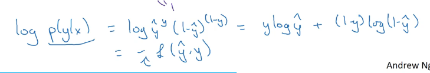

# Second week


## Basic of Neural network programming

当你在你的网络中组织计算的时候，经常使用 forward pause or forward propagation step以及backward pause or backward propagation step.

why the computations in learning an neural network can be organized in this forward propagation and a separate backward propagation.


### Logistic regression

logistic regression is an algorithm for binary classification.


计算机对彩色图片采用的是RGB三通道。图片的大小是像素。

如果图片大小是64pixel*64pixel，三通道的矩阵为$3\cdot64\cdot64$, 64 by 64


转换为12288*1的向量。

X.shape is 12288*1，X作为输入，得到label，y


## logistic regression

binary classification problems


用线性函数来做二分类不好，因为可能大于1，或者小于0.


上图是sigmoid函数。


sigmoid函数方程

Z如果是特别大的正数的话，$e^{-z}$会接近0，最后整个结果接近1。vice versa


## Cost function


superscript i (上标 i)，表示的是第i个。


Loss function:


逻辑回归一般不用squared loss function，因为会得到很多局部最优解。


Cost function:


## Gradient descent algorithm


convex function：凸函数


因为下面那个有很多不同的局部最优。


1. 随便赋一个初值。
2. 沿着最快下降方向，往下走。
3. 最后收敛于global optimum。


编程的时候，一般用dw表示求导。


只有一个变量用d，有两个及以上变量时，使用$\alpha$。叫做partial derivative symbol，偏导数符号。




## Calculus and Derivatives

$f(x)=3x$，x=2, then f(2) = 6.

倒数就是这个三角形。


编程的主要思想，就是让你求导数那个点加一个特别小的数，然后求斜率。


神经网络的计算都是按照forward path or forward propagation step in which we compute the output of the neural network.

首先计算出神经网络的输出，紧接着进行一个反向传输操作，后者我们用来计算出对应的梯度或者导数。


## Derivatives with a computation graph

复合函数求导，基本的求导式子。


## logistic regression gradient descent


minimize the loss function

计算一阶导数。log函数一般都是以e为底的。


a = sigmoid(z) -> $\frac{da}{dz} =\frac{e^{-z}}{(1+e^{-z})^{2}} $将原式a = sigmoid(z)带入da/dz中得到 a(1-a)。

Sigmoid函数由下列公式定义


其对x的导数可以用自身表示：


这个只是一个例子的梯度下降，我们要在每个训练集都要进行


## Gradient descent on m examples.


求和然后求平均值。

就用for循环就行了。


Two weaknesses: 

1. 使用两个for循环，第一个for loop遍历m个训练样本的小循环，第二个for循环时遍历所有特征的循环。在这个例子中我们只有两个特征，n=2, $n_{x}=2$, 如果有更多的话dw1,dw2....$dw_{n}$。使用for循环遍历这n个特征（W）。
2. 向量化操作加速运算，拜托for循环操作。


## Vectorization

其实就是使用python的numpy

```python
import numpy as np
a = np.array([1,2,3,4])
b = np.array([2,3,4,5])
```


Jupyter notebook使用CPU。

avoid using for loop


## More vectorization examples

When you are programming your neural networks, whenever possible avoid explicit for-loops.


```python
import numpy as np
u = np.exp(v)
v**z
```


## Vectorizing logistic Regression


就是IDSS那一套。numpy 


## Vectorizing logistic Regression's Gradient computation


```python
z = np.dot(w.T,x)+b
A=sigmoid(z)
dz = A*Y
dw= 1/m*x*dz.T
db = 1/m*np.sum(dz)
w = w-alpha*dw
b = b-alpha*db
# alpha is the learning rate
```


## Broadcasting in Python

```python
b = a[0,:]/np.sum(a,axis=0) ##按列求和
a.reshape(1,4)
```


```python
import numpy as np
a = np.array([[56.0, 0.0, 4.4, 68.0], [1.2, 104.0, 52.0, 8.0], [1.8, 135.0, 99.0, 0.9]])
c = np.array([1,2,3,4])
print(a*c)
print(a/c)
```


## A note on python/ numpy vectors


如果你已经写成了上面的形式，也可以

```python
a = a.reshape((5,1))
assert(a.shape==(5,1))## 用来检验
```


## Quick tour of Jupyter/ipython notebooks

markdown语言和代码块。


## 为什么逻辑回归的cost function长那样


因为log function is strictly monotonically increasing function.



正好是Loss function的负数，这样正好对应最小化的损失函数，最大的可能性

minimizing the loss corresponds to maximizing the log of probability.

以上内容是单个的训练的。


**m个训练样本的cost function**

the probability of all the labels in the training set.

假设所有的训练样本服从同一分布且相互独立，即**独立同分布**的。

则，所有这些样本的联合概率是每个样本概率的乘积。


最大似然估计：找到合适的参数使得给定样本的观测值概率最大。

令这个概率最大化，等价于令其对数最大化。


训练模型时，目标是让成本函数最小化，


full name : Cross-entropy loss function and logistic regression

[Cross entropy - Wikipedia](https://en.wikipedia.org/wiki/Cross_entropy#Cross-entropy_error_function_and_logistic_regression)


## 神经网络的结构

神经网络的一般结构是由输入层、隐藏层(神经元)、输出层构成的。隐藏层可以是1层或者多层叠加，层与层之间是相互连接的，如下图所示。


一般说到神经网络的层数是这样计算的，输入层不算，从隐藏层开始一直到输出层，一共有几层就代表着这是一个几层的神经网络，例如上图就是一个三层结构的神经网络。

**解释隐藏层的含义：**在一个神经网络中，当你使用监督学习训练它的时候，训练集包含了输入?也包含了目标输出?，所以术语隐藏层的含义是在训练集中，这些中间结点的准确值我们是不知道到的，也就是说你看不见它们在训练集中应具有的值。

- 多隐藏层的神经网络比单隐藏层的神经网络工程效果好很多。
- 提升隐层层数或者隐层神经元个数，神经网络“容量”会变大，空间表达力会变强。
- 过多的隐层和神经元节点，会带来过拟合问题。
- 不要试图通过降低神经网络参数量来减缓过拟合，用正则化或者dropout。


## 3. 神经网络的计算过程

### 3.1 计算过程

如下图所示。用圆圈表示神经网络的计算单元，逻辑回归的计算有两个步骤，首先你按步骤计算出z，然后在第二步中你以 sigmoid 函数为激活函数计算$\hat{y} $，一个神经网络只是这样子做了好多次重复计算。


其中的一个神经元计算如下图所示：


### 3.3 激活函数

#### 3.3.1 激活函数有哪些

在隐层接一个线性变换后 ，再接一个非线性变换(如sigmoid)，这个非线性变换叫做传递函数或者激活函数。上面的例子用的都是逻辑回归的Sigmoid激活函数，如果还不明白激活函数在哪，可以看下面这幅图。


tanh(双曲正切)函数

事实上，tanh 函数是 sigmoid 的向下平移和伸缩后的结果。对它进行了变形后，穿过了(0,0)点，并且值域介于+1 和-1 之间。但有一个例外：在二分类的问题中，对于输出层，因为y的值是 0 或 1，所以想让?y的数值介于0和1之间，而不是在-1和+1之间。所以需要使用sigmoid激活函数。


1. sigmoid函数和tanh函数两者共同的缺点是，在y特别大或者特别小的情况下，导数的梯度或者函数的斜率会变得特别小，最后就会接近于0，导致降低梯度下降的速度。
2. ReLu(修正线性单元)函数只要x是正值的情况下，导数恒等于 1，当x是负值的时候，导数恒等于 0。


#### 3.3.5 激活函数有哪些性质？


### 3.5 反向传播(BP)

反向传播(back-propagation)指的是计算神经网络参数梯度的方法。总的来说，反向传播依据微积分中的链式法则，沿着从输出层到输入层的顺序，依次计算并存储目标函数有关神经网络各层的中间变量以及参数的梯度。


## 4. 为什么说神经网络是端到端的网络?

端到端学习(end-to-end)是一种解决问题的思路，与之对应的是多步骤解决问题，也就是将一个问题拆分为多个步骤分步解决，而端到端是由输入端的数据直接得到输出端的结果。

就是不要预处理和特征提取，直接把原始数据扔进去得到最终结果。

特征提取包含在神经网络内部，所以说神经网络是端到端的网络。

优点：

通过缩减人工预处理和后续处理，尽可能使模型从原始输入到最终输出，给模型更多可以根据数据自动调节的空间，增加模型的整体契合度。

缺点

- 它可能需要大量的数据。要直接学到这个?到?的映射，你可能需要大量(?, ?)数据。
- 它排除了可能有用的手工设计组件。

## 6. softmax分类器


