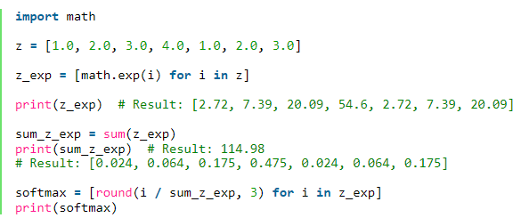

1. 

```python
np.exp（）
math.exp()
```

2. 

-X.shape用于获取矩阵/向量X的shape（维度）。
-X.reshape（...）用于将X重塑为其他尺寸。


3. 


4. 

在numpy中要理解的一个非常重要的概念是“广播”。 这对于在不同形状的数组之间执行数学运算非常有用。 有关广播的完整详细信息，你可以阅读官方的[broadcasting documentation](http://docs.scipy.org/doc/numpy/user/basics.broadcasting.html).

使用numpy实现softmax函数。 你可以将softmax理解为算法需要对两个或多个类进行分类时使用的标准化函数。 你将在本专业的第二门课中了解有关softmax的更多信息。


实现代码：



```python
def softmax(x):
    ### START CODE HERE ### (≈ 3 lines of code)
    # Apply exp() element-wise to x. Use np.exp(...).
    x_exp = np.exp(x)
    # Create a vector x_sum that sums each row of x_exp. Use np.sum(..., axis = 1, keepdims = True).
    x_sum = np.sum(x_exp, axis = 1, keepdims = True)
    # Compute softmax(x) by dividing x_exp by x_sum. It should automatically use numpy broadcasting.
    s = x_exp / x_sum
    ### END CODE HERE ### 
    return s
```

-np.exp（x）适用于任何np.array x并将指数函数应用于每个坐标
-sigmoid函数及其梯度
-image2vector通常用于深度学习
-np.reshape被广泛使用。 保持矩阵/向量尺寸不变有助于我们消除许多错误。
-numpy具有高效的内置功能
-broadcasting非常有用


```python
def image2vector(image):
	v = image.reshape(image.shape[0] * image.shape[1] * image.shape[2], 1)
	return v
image = np.random.rand(3,3,2)
print("image2vector(image) = " + str(image2vector(image)))
```

```python
import numpy as np
def Sigmoid(x):
	s = 1/(1 + np.exp(-x))
	return s
x = np.array([1,2,3])
print("x = " + str(x))
print("Sigmoid(x) = " + str(Sigmoid(x)))
### END CODE HERE ###

#Sigmoid gradient
### 3 START CODE HERE ###
def sigmoid_derivative(x):
	ds = Sigmoid(x) * (1 - Sigmoid(x))
	return ds
print("Sigmoid_derivative(x) = " + str(sigmoid_derivative(x)))
### END CODE HERE ###
```


不同于`np.multiply()`和`*` 操作符（相当于Matlab / Octave中的 `.*`）执行逐元素的乘法，`np.dot()`执行的是矩阵-矩阵或矩阵向量乘法。

```python
## L1损失函数
loss = np.sum(np.abs(y - yhat))

## L2损失函数
loss = np.dot((y - yhat),(y - yhat).T)
```

-向量化在深度学习中非常重要， 它保证了计算的效率和清晰度。
-了解L1和L2损失函数。
-掌握诸多numpy函数，例如np.sum，np.dot，np.multiply，np.maximum等。