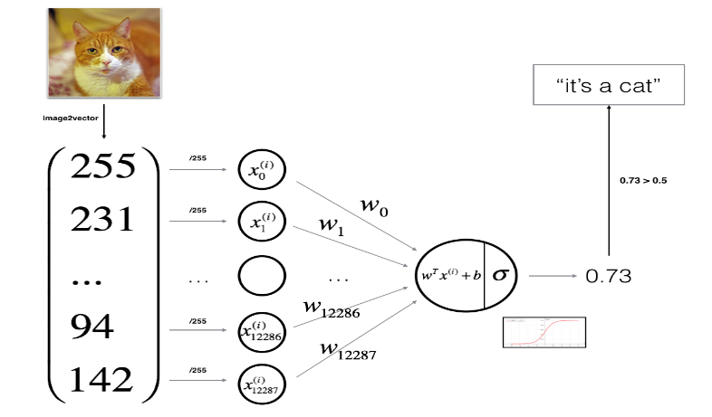
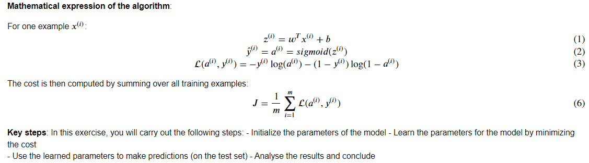

# 用神经网络思想实现Logistic回归

- 建立学习算法的一般架构，包括：
  - 初始化参数
  - 计算损失函数及其梯度
  - 使用优化算法（梯度下降）
- 按正确的顺序将以上所有三个功能集成到一个主模型上。


## 有用工具包

- [h5py](http://www.h5py.org/)是一个常用的包，可以处理存储为H5文件格式的数据集。
- [matplotlib](http://matplotlib.org/)是一个著名的Python图形库。
- numpy


Many software bugs in deep learning come from having matrix/vector dimensions that don't fit. If you can keep your matrix/vector dimensions straight you will go a long way toward eliminating many bugs.


A trick when you want to **flatten a matrix X of shape (a,b,c,d) to a matrix X_flatten of shape (b∗c∗d, a)** is to use:

```python
# method:
X_flatten = X.reshape(X.shape[0], -1).T

# YOUR CODE STARTS HERE
train_set_x_flatten = train_set_x_orig.reshape(train_set_x_orig.shape[0],train_set_x_orig.shape[2]**2*3).T
test_set_x_flatten = test_set_x_orig.reshape(test_set_x_orig.shape[0],test_set_x_orig.shape[2]**2*3).T
# YOUR CODE ENDS HERE
```


显示图片

```python
plt.imshow(train_set_x_orig[index])
```


**识别猫项目的流程，预处理部分**

1. 加载数据。
2. Reshape the training and test data sets so that images of size$ (num_{px}, num_{px}, 3) $are flattened into single vectors of shape $(num_{px} ∗ num_{px} ∗ 3, 1)$.

3. To represent color images, the red, green and blue channels (RGB) must be specified for each pixel, and so the pixel value is actually a vector of three numbers ranging from 0 to 255.
4. One common preprocessing step in machine learning is to center and standardize your dataset, meaning that you substract the mean of the whole numpy array from each example, and then divide each example by the standard deviation of the whole numpy array. But for picture datasets, it is simpler and more convenient and works almost as well to just divide every row of the dataset by 255 (the maximum value of a pixel channel).
5. 

Common steps for pre-processing a new dataset are:

- Figure out the dimensions and shapes of the problem (m_train, m_test, num_px, ...)
- Reshape the datasets such that each example is now a vector of size (num_px * num_px * 3, 1)
- "Standardize" the data


**设计一个算法**

build a Logistic Regression, using a Neural Network mindset.






## Building the parts of our algorithm

The main steps for building a Neural Network are:

1. Define the model structure (such as number of input features)
2. Initialize the model's parameters
3. Loop:
   - Calculate current loss (forward propagation)
   - Calculate current gradient (backward propagation)
   - Update parameters (gradient descent)

You often build 1-3 separately and integrate them into one function we call `model()`.


$w^TX$ = np.dot(w.T, X)

```python
import copy
w = copy.deepcopy(w)
b = copy.deepcopy(b)
```

分清啥时候element wise啥时候是np.dot


1. Preprocessing the dataset is important.
2. You implemented each function separately: initialize(), propagate(), optimize(). Then you built a model().
3. Tuning the learning rate (which is an example of a "hyperparameter") can make a big difference to the algorithm. You will see more examples of this later in this course!


本次实验将W和B都初始化为0，可能是因为只有一个隐藏层一个神经元的原因。