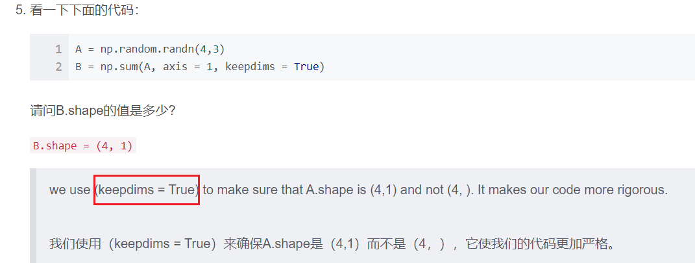

都是正确的。

----------

tanh激活函数通常比隐藏层单元的sigmoid激活函数效果更好，因为其输出的平均值更接近于零，因此它将数据集中在下一层是更好的选择。

---------------

--------------------

二分类一般采用sigmoid函数。

----------------

------------

假设你已经建立了一个神经网络。 您决定将权重和偏差初始化为零。 以下哪项陈述是正确的？

【★】第一个隐藏层中的每个神经元节点将执行相同的计算。 所以即使经过多次梯度下降迭代后，层中的每个神经元节点都会计算出与其他神经元节点相同的东西。
【 】 第一个隐藏层中的每个神经元将在第一次迭代中执行相同的计算。 但经过一次梯度下降迭代后，他们将学会计算不同的东西，因为我们已经“破坏了对称性”。
【 】第一个隐藏层中的每一个神经元都会计算出相同的东西，但是不同层的神经元会计算不同的东西，因此我们已经完成了“对称破坏”。
【 】即使在第一次迭代中，第一个隐藏层的神经元也会执行不同的计算， 他们的参数将以自己的方式不断发展。

----------------------

**逻辑回归与神经网络的关系：**
[逻辑回归](https://so.csdn.net/so/search?q=逻辑回归&spm=1001.2101.3001.7020)可以看作是只有1个神经元的单层神经网络，神经网络就是一组神经元连接在一起的网络，隐藏层可以有多个神经元，每个神经元本身就对应着一个逻辑回归过程。

**神经网络的权重不能全为0的原因：**
神经网络的权重w 的不同代表输入的向量有不同的特征，即权重越大的特征越重要，比如在人脸识别中，人脸的属性有眼睛，鼻子，嘴巴，眉毛，其中眼睛更能够影响人脸的识别，所以我们给与眼睛更大的权重。

如果将权重初始化全为0，那么隐藏层的各个神经元的结果都是一样的，从而正向传播的结果是一样的，反向传播求得的梯度也是一样的，也就是说不管经过多少次迭代，更新的w(i)是相同的，这样就判断不了哪个特征比较重要了。

因此，初始w不同，可以学到不同的特征，如果都是0或某个值，由于计算方式相同，可能达不到学习不同特征的目的。

**逻辑回归的权重可以初始化为0的原因：**
Logistic回归没有隐藏层。 如果将权重初始化为零，则Logistic回归中的第一个示例x将输出零，但Logistic回归的导数取决于不是零的输入x（因为没有隐藏层）。 因此，在第二次迭代（迭代发生在w和b值的更新中，即梯度下降）中，如果x不是常量向量，则权值遵循x的分布并且彼此不同。

Logistic回归的权重w应该随机初始化，而不是全零，因为如果初始化为全零，那么逻辑回归将无法学习到有用的决策边界，因为它将无法“破坏对称性”，是正确的吗？

【 】True
【★】False
Logistic Regression doesn’t have a hidden layer. If you initialize the weights to zeros, the first example x fed in the logistic regression will output zero but the derivatives of the Logistic Regression depend on the input x (because there’s no hidden layer) which is not zero. So at the second iteration, the weights values follow x’s distribution and are different from each other if x is not a constant vector.

Logistic回归没有隐藏层。 如果将权重初始化为零，则Logistic回归中的第一个示例x将输出零，但Logistic回归的导数取决于不是零的输入x（因为没有隐藏层）。 因此，在第二次迭代中，如果x不是常量向量，则权值遵循x的分布并且彼此不同。

---------------------

您已经为所有隐藏单元使用tanh激活建立了一个网络。 使用np.random.randn（..，..）* 1000将权重初始化为相对较大的值。 会发生什么？

【 】这没关系。只要随机初始化权重，梯度下降不受权重大小的影响。

【 】这将导致tanh的输入也非常大，因此导致梯度也变大。因此，您必须将α设置得非常小以防止发散; 这会减慢学习速度。

【 】这会导致tanh的输入也非常大，导致单位被“高度激活”，从而加快了学习速度，而权重必须从小数值开始。

【★】这将导致tanh的输入也很大，因此导致梯度接近于零， 优化算法将因此变得缓慢。

tanh becomes flat for large values, this leads its gradient to be close to zero. This slows down the optimization algorithm.

tanh对于较大的值变得平坦，这导致其梯度接近于零。 这减慢了优化算法。

------------------

------------------------

