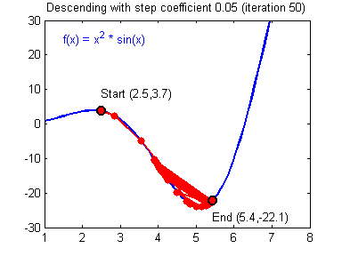

shape的第二个一般是样本的个数。


The dataset is not linearly separable, so logistic regression doesn't perform well. Hopefully a neural network will do better. Let's try this now!


Logistic regression didn't work well on the flower dataset. Next, you're going to train a Neural Network with a single hidden layer and see how that handles the same problem.

**Reminder**: 

The general methodology to build a Neural Network is to: 

1. Define the neural network structure ( of input units, of hidden units, etc). 
2. Initialize the model's parameters 
3. Loop: - Implement forward propagation - Compute loss - Implement backward propagation to get the gradients - Update parameters (gradient descent)


每一层隐藏单元的数组就是当前数组shape的第一个，上一层隐藏单元的个数就是当前数组shape的第二个。


数组只有是np.array()才能直接使用*。  

------------------


```python
Argument:
    n_x -- size of the input layer
    n_h -- size of the hidden layer
    n_y -- size of the output layer
Returns:
params -- python dictionary containing your parameters:
                W1 -- weight matrix of shape (n_h, n_x)
                b1 -- bias vector of shape (n_h, 1)
                W2 -- weight matrix of shape (n_y, n_h)
                b2 -- bias vector of shape (n_y, 1)
## 例如下图W1就是（4，2），b1就是（4，1），w2就是（1，4），b2就是（1，1）
```


-------------------


梯度下降最上面那种写法是不对的。

-------------------------------


模型主要步骤

1. 初始化参数，遵循W不为0，b可以为0。

2. ```python
   parameters = initialize_parameters(n_x,n_h,n_y)
   ```


3. 设置循环次数，开始循环，for i in range(0, num_iterations):

4. 循环内部

5. 

3. 可以看出，先进行前向传播，计算损失（损失只是为了打印，无其他用处），计算后向传播（其实就是计算各种导数），更新参数。
4. grads里面存的是所有后向传播用的导数；cache里面存的是每一个式子的计算结果（Z1 = w1X+b, A1 = tanh(Z1)）；

------------------


右边从上往下数，第二步，m是样本数量

X是（2，m），W1是（4，2），b1是（4，1），Z1是（4，m），A1是（4，m），

W2是（1，4），b2是（1，1）

dZ2 是（1，m），A1是（4，m）

我感觉（1，m）（m，4）这样乘的话前面要加一个1/m

--------------------


学习率太大会导致震荡，学习率太小导致学习速度很慢。

</img>

</img>


Predict函数可以简化成这样。

-------------------------

### 回顾：

Here's a quick recap of all you just accomplished:

- Built a complete 2-class classification neural network with a hidden layer
- Made good use of a non-linear unit
- Computed the cross entropy loss
- Implemented forward and backward propagation
- Seen the impact of varying the hidden layer size, including overfitting.

You've created a neural network that can learn patterns! Excellent work. Below, there are some optional exercises to try out some other hidden layer sizes, and other datasets.

----------------------------

4个隐藏单元


### Summary

- The larger models (with more hidden units) are able to fit the training set better, until eventually the largest models **overfit** the data.
- The best hidden layer size seems to be around **n_h = 5**. Indeed, a value around here seems to fits the data well without also incurring noticeable overfitting.
- Later, you'll become familiar with regularization, which lets you use very large models (such as n_h = 50) without much overfitting.