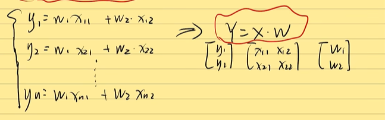

如果$f(x)=\dot{x^T}{x}$，那么$\frac{df(x)}{dx}=?$

## 向量函数和矩阵求导的初印象

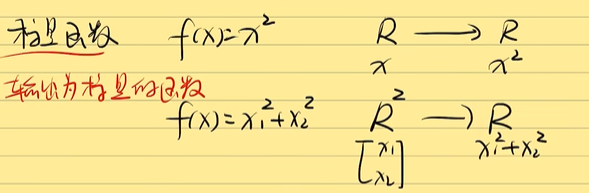

**标量函数**：输出为标量的函数。

**向量函数**：输出为向量（矩阵）的函数

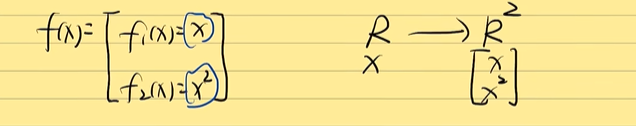

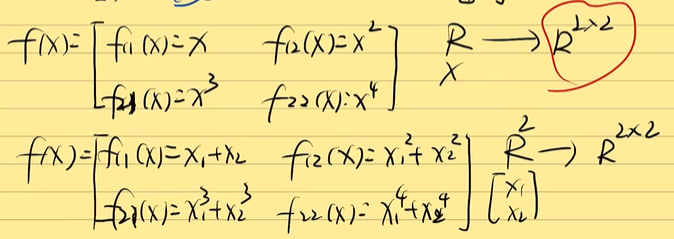

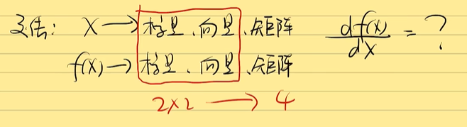

四种情况：

标量对标量求导，向量对向量求导，标量对向量求导，向量对标量求导。

**矩阵求导的本质：**

$\frac{dA}{dB}$:矩阵A中的每一个元素对矩阵B中每一个元素求导。

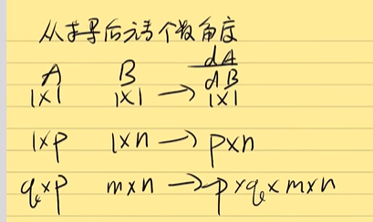

## 求导秘术--Yx拉伸

1. 标量不变，向量拉伸。
2. 前面横向拉，后面纵向拉，Y横向拉，X纵向拉。

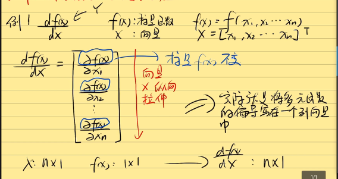

分母布局，雅可比矩阵。

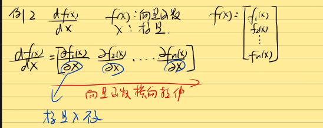

X和Y都是向量的话，先拉伸X

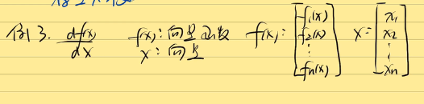

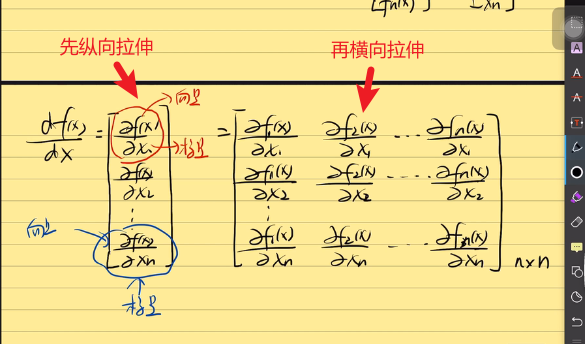

## 常见矩阵求导公式推导

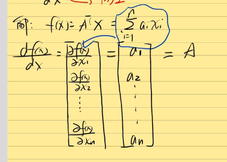

PS：$f(x)=A^{T}X=X^{T}a$，之所以可以这么写是因为$f(x)$是标量。

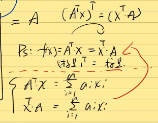

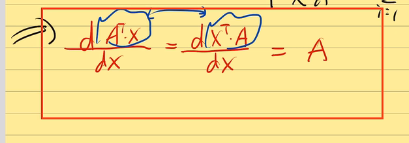

例二：

